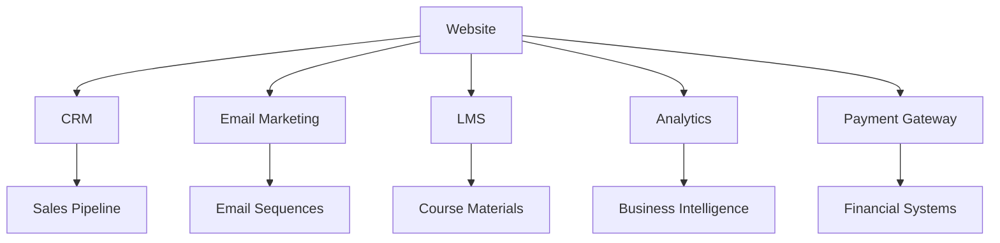

# EPIC-104: Integration & Automation

**Project**: Business Website  
**Status**: ⬜ Not Started  
**Priority**: High  
**Points**: 20  
**Timeline**: 3 weeks  
**Dependencies**: EPIC-103 (Technical Implementation)

---

## 📋 Description

Implement comprehensive business system integrations and marketing automation to create seamless workflows between the website, CRM, learning management system, and marketing tools for optimal lead nurturing and customer experience.

## 🎯 Goals

- Automate lead capture, qualification, and nurturing processes
- Integrate course delivery with existing educational materials
- Create seamless customer journey from discovery to enrollment
- Establish analytics and reporting for data-driven optimization
- Build scalable automation for business growth

## ✅ Acceptance Criteria

- [ ] CRM integration capturing all leads and customer interactions
- [ ] Email marketing automation with personalized sequences
- [ ] Course delivery system connected to existing curricula
- [ ] Analytics dashboard with key business metrics
- [ ] Payment processing fully automated with proper tax handling
- [ ] Customer support system integrated with knowledge base

## 📖 User Stories

### 1. **CRM & Lead Management Integration** (6 pts)
**As a** sales team member  
**I want to** automatically capture and track all website leads  
**So that I can** efficiently follow up and convert prospects

**Integration Requirements:**
- [ ] HubSpot/Salesforce CRM connection
- [ ] Automated lead scoring based on behavior
- [ ] Lead assignment and routing rules
- [ ] Activity tracking and timeline management
- [ ] Deal pipeline automation

**Tasks:**
- [ ] Set up CRM API integration with secure authentication
- [ ] Build lead capture forms with automatic CRM sync
- [ ] Implement lead scoring algorithm based on engagement
- [ ] Create automated lead assignment workflows
- [ ] Set up deal pipeline with stage progression rules

### 2. **Email Marketing Automation** (5 pts)
**As a** marketing manager  
**I want to** nurture leads with personalized email sequences  
**So that I can** increase conversion rates and customer engagement

**Automation Workflows:**
- [ ] Welcome series for new subscribers
- [ ] Course-specific nurture sequences
- [ ] Abandoned cart recovery
- [ ] Post-purchase onboarding
- [ ] Re-engagement campaigns

**Tasks:**
- [ ] Integrate with Mailchimp/ConvertKit/HubSpot Email
- [ ] Build segmentation logic for personalized messaging
- [ ] Create dynamic email templates with course content
- [ ] Set up behavioral triggers and automated sequences
- [ ] Implement email performance tracking and optimization

### 3. **Course Delivery System Integration** (4 pts)
**As a** enrolled student  
**I want to** seamlessly access my course materials  
**So that I can** focus on learning without technical barriers

**Learning Management Features:**
- [ ] Single sign-on (SSO) integration
- [ ] Progress tracking and completion certificates
- [ ] Course material delivery from existing curricula
- [ ] Interactive assignments and assessments
- [ ] Student community and discussion forums

**Tasks:**
- [ ] Integrate with LMS platform (Teachable/Thinkific/Custom)
- [ ] Build course enrollment automation
- [ ] Connect existing course materials to delivery platform
- [ ] Implement progress tracking and analytics
- [ ] Set up completion certificates and badging system

### 4. **Analytics & Reporting Dashboard** (3 pts)
**As a** business owner  
**I want to** monitor key performance metrics  
**So that I can** make data-driven decisions for growth

**Analytics Integration:**
- [ ] Google Analytics 4 with enhanced e-commerce
- [ ] Custom business dashboard with KPIs
- [ ] Course performance and student success metrics
- [ ] Marketing attribution and ROI tracking
- [ ] Automated reporting and alerts

**Tasks:**
- [ ] Set up Google Analytics with conversion goals
- [ ] Build custom analytics dashboard
- [ ] Implement marketing attribution tracking
- [ ] Create automated reports for stakeholders
- [ ] Set up performance monitoring and alerts

### 5. **Payment & Billing Automation** (2 pts)
**As a** customer  
**I want to** complete purchases smoothly  
**So that I can** quickly access my courses

**Payment Processing:**
- [ ] Multi-payment method support
- [ ] Automated invoicing and receipts
- [ ] Subscription management
- [ ] Tax calculation and compliance
- [ ] Refund and chargeback handling

**Tasks:**
- [ ] Complete Stripe/PayPal integration setup
- [ ] Implement automated tax calculation
- [ ] Set up subscription and billing management
- [ ] Build invoice generation and delivery
- [ ] Create refund and cancellation workflows

---

## 🔧 Integration Architecture

### System Overview


### Data Flow Architecture
```typescript
// Lead Capture Flow
Website Form → CRM Lead → Email Automation → Course Enrollment

// Customer Journey Mapping
interface CustomerJourney {
  visitor: WebsiteVisitor;
  lead: CRMLead;
  prospect: EmailSubscriber;
  customer: CourseStudent;
  advocate: CertifiedGraduate;
}
```

---

## 📊 Integration Specifications

### CRM Integration (HubSpot/Salesforce)
```typescript
// CRM Data Model
interface CRMIntegration {
  leads: {
    capture: 'form_submission' | 'chat_interaction' | 'content_download';
    scoring: LeadScoringRules;
    assignment: LeadRoutingRules;
    lifecycle: LeadStageProgression;
  };
  
  deals: {
    creation: 'course_interest' | 'consultation_request';
    pipeline: DealStages[];
    automation: WorkflowRules[];
  };
  
  contacts: {
    segmentation: ContactSegments;
    enrichment: DataEnrichmentRules;
    communication: CommunicationPreferences;
  };
}
```

### Email Marketing Integration
```typescript
// Email Automation Workflows
interface EmailAutomation {
  sequences: {
    welcome: WelcomeEmailSequence;
    nurture: CourseSpecificNurture;
    sales: SalesEmailSequence;
    onboarding: CustomerOnboarding;
    retention: RetentionCampaigns;
  };
  
  triggers: {
    behavioral: BehaviorTriggers;
    temporal: TimeBased;
    milestone: AchievementBased;
  };
  
  personalization: {
    dynamic_content: PersonalizationRules;
    segmentation: AudienceSegments;
    optimization: ABTestingFramework;
  };
}
```

### Course Delivery Integration
```typescript
// Learning Management System
interface LMSIntegration {
  enrollment: {
    automatic: PaymentBasedEnrollment;
    manual: AdminManagedEnrollment;
    bulk: CorporateEnrollments;
  };
  
  content_delivery: {
    existing_courses: ExistingCurriculaMapping;
    progressive_unlock: ContentReleaseSchedule;
    interactive_elements: AssignmentsAndQuizzes;
  };
  
  tracking: {
    progress: StudentProgressTracking;
    completion: CertificateGeneration;
    engagement: LearningAnalytics;
  };
}
```

---

## 🚀 Automation Workflows

### Lead Nurturing Workflow
```yaml
# Lead Scoring & Nurturing
Visitor Actions:
  - Page Views: +1 point per AI course page
  - Content Downloads: +5 points per resource
  - Email Opens: +2 points per campaign
  - Course Previews: +10 points per preview
  - Consultation Requests: +20 points

Automation Triggers:
  - Score 0-20: General nurture sequence
  - Score 21-50: Course-specific content
  - Score 51-80: Sales outreach automation
  - Score 80+: High-intent prospect workflow
```

### Course Enrollment Automation
```yaml
# Enrollment Process
Payment Completion:
  1. Instant course access provisioning
  2. Welcome email with login credentials
  3. Course materials delivery schedule
  4. Student community access
  5. Calendar integration for live sessions

Progress Tracking:
  1. Module completion notifications
  2. Assignment submission reminders
  3. Progress milestone celebrations
  4. Certificate eligibility alerts
  5. Alumni community invitations
```

### Customer Success Automation
```yaml
# Post-Purchase Experience
Day 0: Welcome & Onboarding
Day 1: Course access confirmation
Day 7: Progress check and support offer
Day 14: Mid-course motivation and resources
Day 30: Completion milestone and next steps
Day 60: Alumni network invitation
Day 90: Advanced course recommendations
```

---

## 📈 Success Metrics & KPIs

### Lead Management Metrics
| Metric | Target | Measurement |
|--------|--------|-------------|
| Lead Capture Rate | 3% of visitors | CRM analytics |
| Lead-to-Customer | 15% conversion | Sales pipeline |
| Lead Response Time | < 2 hours | CRM automation |
| Lead Scoring Accuracy | 80%+ qualified | Sales feedback |

### Email Marketing Metrics
| Metric | Target | Measurement |
|--------|--------|-------------|
| Open Rates | 25%+ | Email platform |
| Click-through Rates | 5%+ | Email analytics |
| Sequence Completion | 70%+ | Automation stats |
| Email-to-Sale | 10%+ | Attribution tracking |

### Course Delivery Metrics
| Metric | Target | Measurement |
|--------|--------|-------------|
| Enrollment Success | 99%+ | LMS integration |
| Course Completion | 85%+ | Progress tracking |
| Student Satisfaction | 4.5/5 | Course feedback |
| Certification Rate | 80%+ | Achievement data |

---

## 🔧 Technical Implementation

### Integration Development Timeline

#### Week 1: Core Integrations
**Days 1-2: CRM Setup**
- [ ] Configure CRM API connections
- [ ] Build lead capture and sync functionality
- [ ] Set up automated lead scoring rules
- [ ] Test data flow and error handling

**Days 3-5: Email Marketing**
- [ ] Connect email marketing platform
- [ ] Build subscriber segmentation logic
- [ ] Create automated email sequences
- [ ] Set up behavioral triggers

#### Week 2: Advanced Features
**Days 1-3: Course Delivery**
- [ ] Integrate LMS platform
- [ ] Connect existing course materials
- [ ] Build enrollment automation
- [ ] Set up progress tracking

**Days 4-5: Analytics Setup**
- [ ] Configure Google Analytics goals
- [ ] Build custom analytics dashboard
- [ ] Set up conversion tracking
- [ ] Create automated reporting

#### Week 3: Testing & Optimization
**Days 1-2: Payment Integration**
- [ ] Complete payment gateway setup
- [ ] Build subscription management
- [ ] Test automated billing flows
- [ ] Set up financial reporting

**Days 3-5: Testing & Launch**
- [ ] End-to-end integration testing
- [ ] User acceptance testing
- [ ] Performance optimization
- [ ] Documentation and training

---

## 🔒 Security & Compliance

### Data Protection
- [ ] **GDPR Compliance**: Proper consent management and data handling
- [ ] **CCPA Compliance**: California privacy law requirements
- [ ] **PCI Compliance**: Secure payment processing standards
- [ ] **SOC 2**: Security standards for customer data protection

### Integration Security
- [ ] **API Security**: OAuth 2.0 and secure token management
- [ ] **Data Encryption**: End-to-end encryption for sensitive data
- [ ] **Access Control**: Role-based permissions for all integrations
- [ ] **Audit Logging**: Comprehensive activity tracking and monitoring

---

## 🧪 Testing Strategy

### Integration Testing
```typescript
// Test Coverage Areas
- API Connection Testing: All third-party integrations
- Data Sync Testing: CRM, Email, LMS data flow
- Workflow Testing: Automated sequences and triggers
- Performance Testing: Integration response times
- Error Handling: Failure scenarios and recovery
```

### User Acceptance Testing
- [ ] Lead capture and CRM sync accuracy
- [ ] Email automation trigger reliability
- [ ] Course enrollment and access provisioning
- [ ] Payment processing and subscription management
- [ ] Analytics data accuracy and reporting

---

## 🔄 Maintenance & Monitoring

### Ongoing Maintenance
- **Daily**: Monitor integration health and error logs
- **Weekly**: Review automation performance metrics
- **Monthly**: Optimize workflows based on performance data
- **Quarterly**: Update integrations and add new features

### Monitoring & Alerting
- **Integration Health**: API status and response time monitoring
- **Data Quality**: Automated data validation and error detection
- **Performance**: Workflow execution time and success rates
- **Security**: Unauthorized access attempts and security breaches

---

## 🏷️ Tags

`integration` `automation` `crm` `email-marketing` `lms` `analytics` `payments`

---

## 📞 Dependencies & Handoffs

### Depends On
- **EPIC-103**: Fully functional website with course catalog and user accounts

### Provides To
- **EPIC-105**: Integrated systems ready for launch optimization and monitoring

---

*This epic focuses on creating a seamless, automated business system that maximizes the value of existing course materials while providing exceptional customer experience through intelligent automation and integration.*