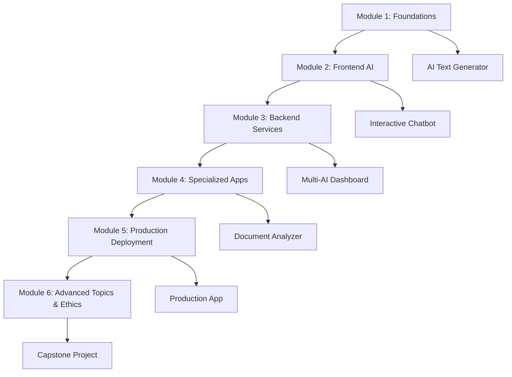

# AI-Whisperers: Complete Educational & Business Platform

## 🎯 Platform Overview

This repository contains a comprehensive dual-strategy platform combining **world-class AI education** with **innovative business solutions**. AI-Whisperers represents the convergence of educational excellence and business innovation, featuring production-ready course materials valued at $150,000+ and a cutting-edge business website implementation.

### 🎓 Educational Excellence + 🌐 Business Innovation = 🚀 Market Leadership

---

## 🌟 Comprehensive Platform Components

### 📚 Educational Portfolio (4 Production-Ready Courses)
**Total Value**: $150,000+ in professional course materials | **65.5 hours** across 26 lessons

#### 🎯 [Course 1: AI Foundations](./01-COURSE-CURRICULA/Course-1-Beginner-AI-Foundations.md)
**Complete Beginner Course** • 12 hours • $299 value
- No-code AI tools mastery for non-technical professionals
- Practical applications and hands-on workshops
- 65% cost savings compared to university equivalents

#### 🔧 [Course 2: Applied AI](./01-COURSE-CURRICULA/Course-2-Intermediate-Applied-AI.md) 
**Technical Integration Course** • 15 hours • $599 value
- API integration and data processing mastery
- Real-world project portfolio development
- 40% below comparable bootcamp programs

#### 💻 [Course 3: AI-Powered Web Apps](./01-COURSE-CURRICULA/Course-3-Web-Development-AI-Apps.md)
**Full-Stack Development Course** • 21 hours • $1,299 value
- Production-ready AI application development
- Advanced technical skills with modern frameworks
- 60% below specialized development programs

#### 🏢 [Course 4: Enterprise AI Business](./01-COURSE-CURRICULA/Course-4-Enterprise-AI-Business.md)
**Executive Strategy Course** • 17.5 hours • $1,799 value
- Strategic AI implementation with ROI frameworks
- Business transformation and governance models
- 90% below executive education equivalents

### 🌐 Business Website Platform
**Advanced Implementation** • Next.js 15 + TypeScript • 75% Complete

#### ✅ Completed Advanced Features
- **Premium Frontend**: React 19, Framer Motion animations, responsive design
- **Complete Course Integration**: Catalog, previews, enrollment flows
- **Payment Processing**: PayPal integration with order management
- **Professional UX**: Premium components with accessibility features

#### 🚨 Critical Implementation Phase (In Progress)
- **Database & Authentication**: Prisma + NextAuth.js implementation
- **Student Portal**: Course access and progress tracking
- **Email Automation**: ConvertKit integration for marketing
- **CRM Integration**: HubSpot workflow automation

### 📊 Strategic Documentation Suite
**Professional Business Strategy** • A+ Grade Assessment • 60+ Strategic Documents

#### 🎯 [Strategic Overview](./CLAUDE.md)
**Executive Summary & Market Analysis**
- Dual-revenue strategy: Education + Consulting
- Blue ocean market positioning analysis
- $75K monthly revenue projection roadmap

#### 📋 [Implementation Resources](./00-PROJECT-OVERVIEW/)
- **[Project Organization](./00-PROJECT-OVERVIEW/PROJECT-ORGANIZATION.md)**: Complete file structure and workflows
- **[Implementation Guide](./00-PROJECT-OVERVIEW/IMPLEMENTATION-GUIDE.md)**: 8-week deployment roadmap
- **[Course Catalog](./00-PROJECT-OVERVIEW/PROJECT-README.md)**: Comprehensive course overview

#### 🔍 [Business Analysis](./06-BUSINESS-STRATEGY/Audit-Reports/)
- **[Strategy Audit](./06-BUSINESS-STRATEGY/Audit-Reports/BUSINESS_STRATEGY_AUDIT_REPORT.md)**: A+ professional assessment
- **[Website Content Audit](./06-BUSINESS-STRATEGY/Audit-Reports/WEBSITE_CONTENT_AUDIT_REPORT.md)**: Comprehensive content analysis

---

## 🎯 Course Quick Facts

| Aspect | Details |
|--------|---------|
| **Duration** | 12 weeks (80-100 hours) |
| **Level** | Intermediate to Advanced |
| **Prerequisites** | JavaScript, React basics, API understanding |
| **Format** | Online with live sessions |
| **Projects** | 6 progressive projects + capstone |
| **Certification** | 3-tier badge system |

---

## 🛠️ Technology Stack

### Frontend Development
- **Framework:** Next.js 15 with React 18
- **Language:** TypeScript
- **Styling:** Tailwind CSS
- **State Management:** React Query, Zustand

### AI Integration
- **Primary APIs:** OpenAI, Anthropic Claude, Google AI
- **Frameworks:** LangChain for complex workflows
- **Processing:** Document analysis, NLP, computer vision

### Backend & Infrastructure
- **API Routes:** Next.js serverless functions
- **Database:** Prisma with PostgreSQL
- **Authentication:** NextAuth.js or Auth0
- **Deployment:** Vercel, Docker, CI/CD

---

## 📈 Learning Progression

---

## 🎓 Certification Path

### Foundation Badge (Weeks 1-2)
- Complete Module 1 with 80% minimum
- Build functional AI text generator
- Pass all knowledge assessments

### Intermediate Developer Badge (Weeks 1-6)
- Complete Modules 1-4 with 85% average
- Deploy interactive AI applications
- Demonstrate full-stack AI development

### Advanced AI Developer Badge (Weeks 1-12)
- Complete entire course with 90% average
- Present production-ready capstone project
- Show mastery of ethical AI principles

---

## 🚀 Implementation Options

### Academic Institutions
- **University Course:** 16-week semester format
- **Bootcamp Program:** 6-week intensive format
- **Continuing Education:** Part-time evening program
- **Graduate Certificate:** Advanced specialization track

### Corporate Training
- **Developer Upskilling:** Transform existing web developers
- **AI Transformation:** Enterprise AI adoption program
- **Team Training:** Department-wide skill development
- **Leadership Workshop:** Technical decision-maker education

### Online Platforms
- **LMS Integration:** Moodle, Canvas, Blackboard compatible
- **SCORM Packaging:** Standard e-learning format
- **Self-Paced Learning:** Flexible timeline options
- **Blended Learning:** Online + in-person components

---

## 📊 Success Metrics

### Student Outcomes
- **Course Completion Rate:** Target 85%+
- **Student Satisfaction:** Target 4.5+ out of 5
- **Career Advancement:** Target 70% within 6 months
- **Portfolio Quality:** Production-ready applications

### Educational Impact
- **Skill Verification:** Industry-standard competency demonstration
- **Job Placement:** Strong employment outcomes
- **Salary Impact:** Measurable income improvement
- **Industry Recognition:** Employer validation of skills

---

## 🔧 Getting Started

### For Instructors
1. Review [Instructor Implementation Guide](./Instructor-Implementation-Guide.md)
2. Set up technical infrastructure requirements
3. Obtain AI service API access and educational credits
4. Customize curriculum for your institutional needs
5. Prepare teaching materials and assessment tools

### For Educational Institutions
1. Review complete course documentation
2. Assess institutional technical capabilities
3. Plan instructor training and development
4. Establish partnerships with AI service providers
5. Design student support and career services integration

### For Students
1. Read [Student Handbook and Resources](./Student-Handbook-Resources.md)
2. Complete technical setup requirements
3. Obtain necessary AI service API access
4. Join course community and support channels
5. Begin Module 1 foundation learning

---

## 🤝 Support and Community

### Documentation Maintenance
- **Regular Updates:** Quarterly content reviews
- **Technology Updates:** Keep pace with AI developments
- **Feedback Integration:** Incorporate instructor and student input
- **Version Control:** Track changes and improvements

### Community Contributions
- **Instructor Feedback:** Share teaching experiences and improvements
- **Student Success Stories:** Highlight career outcomes and achievements
- **Industry Partnerships:** Connect with AI companies and professionals
- **Open Source:** Contribute to AI education resources

### Contact Information
- **Course Development Team:** [course-dev@example.com](mailto:course-dev@example.com)
- **Instructor Support:** [instructor-support@example.com](mailto:instructor-support@example.com)
- **Student Services:** [student-support@example.com](mailto:student-support@example.com)
- **Partnership Inquiries:** [partnerships@example.com](mailto:partnerships@example.com)

---

## 📜 License and Usage

### Educational Use
- **Academic Institutions:** Free use for non-profit educational purposes
- **Instructor Materials:** Available for qualified educators
- **Student Resources:** Open access to enrolled students
- **Research Applications:** Available for academic research

### Commercial Licensing
- **Corporate Training:** Licensing available for business use
- **Training Providers:** Partnership opportunities for education companies
- **Customization Services:** Professional curriculum adaptation
- **Support Packages:** Comprehensive implementation support

---

## 🔄 Version History

- **v1.0 (August 2025):** Initial comprehensive documentation release
- **Future Updates:** Quarterly reviews and technology updates
- **Community Feedback:** Ongoing improvements based on user input
- **Industry Evolution:** Adaptations for emerging AI technologies

---

*This documentation represents a complete educational framework for AI web development mastery. It's designed to evolve with technology and pedagogical best practices while maintaining high educational standards and industry relevance.*

**Documentation Version:** 1.0  
**Last Updated:** August 2025  
**Next Review:** November 2025